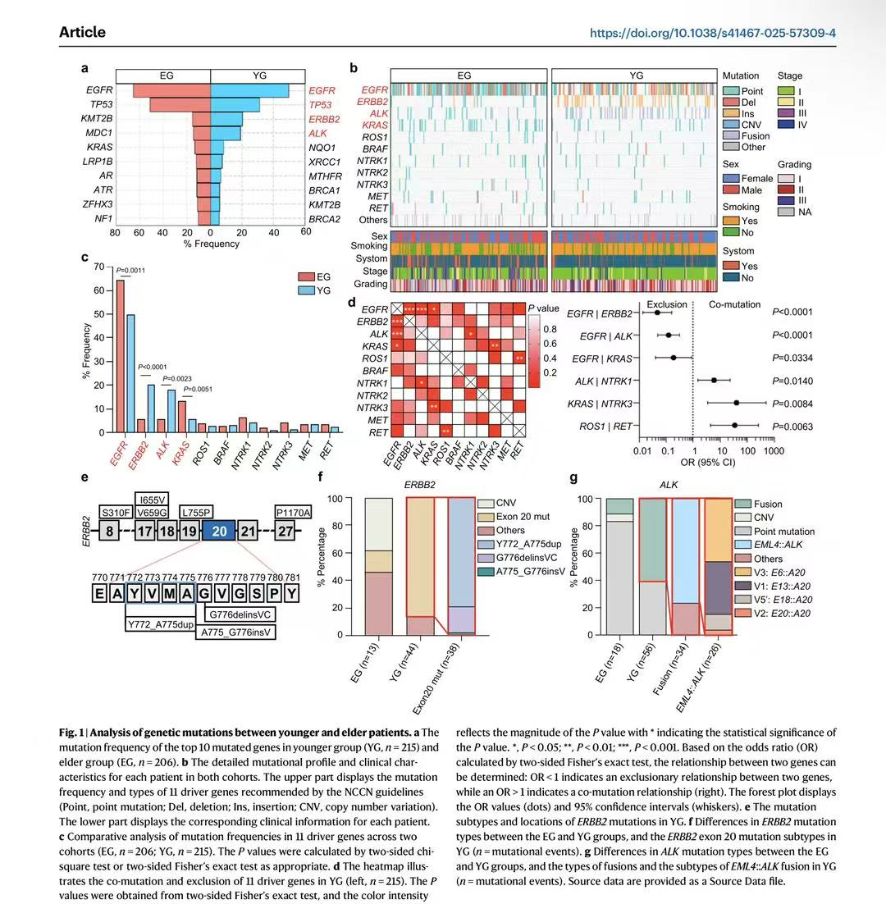
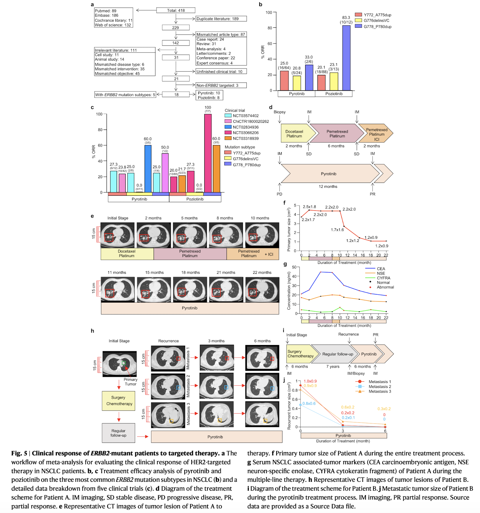
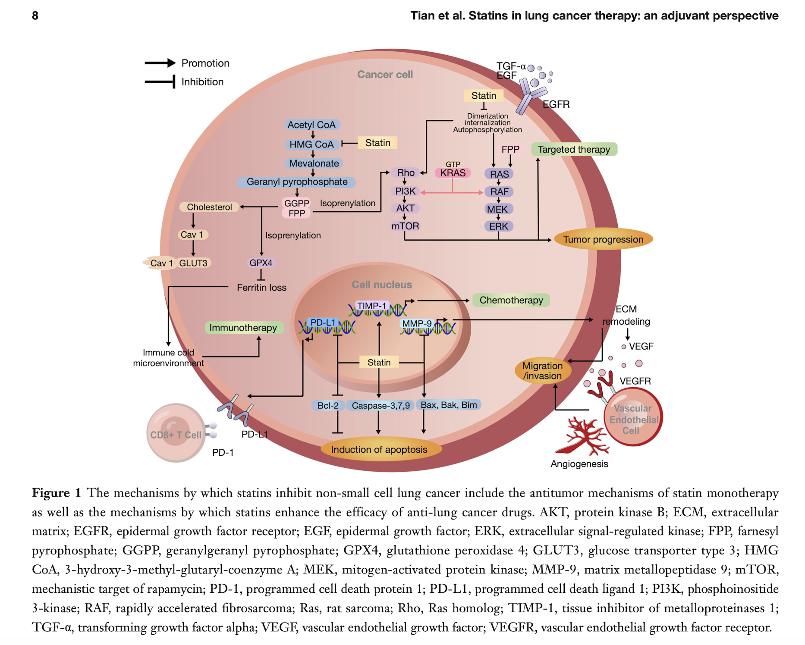
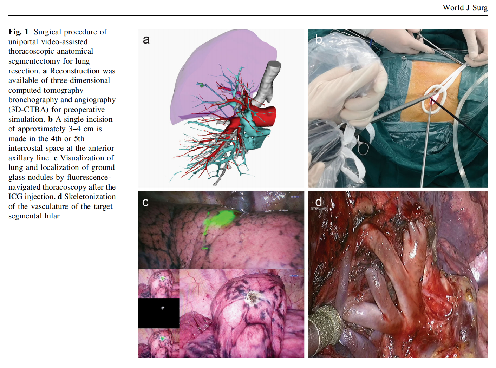

---
# Leave the homepage title empty to use the site title
title:
type: "landing"
sections:
  - block: markdown
    content:
      title: 
      subtitle: 
      text: 
        

          

            

              

                

                  
                

                <h3>Clinical work and Research fields</h3>
                
Dr. Ye Tian practices at the Department of Cardiothoracic Surgery of the Fourth Affiliated Hospital of China Medical University. The department serves as a key center in northern Shenyang for minimally invasive lung cancer treatment, digital integrated lung cancer diagnosis, and chest trauma care. It performs over a thousand surgeries annually and is dedicated to the secondary and tertiary prevention and treatment of lung cancer.

                
 With extensive frontline clinical experience in cardiothoracic surgery, Dr. Ye Tian played a significant role in the achievement and transformation of the research outcome titled "Establishment and Transformation of Key Technologies for Integrated Diagnosis and Treatment of Early-Stage Lung Cancer," which was awarded the Liaoning Provincial Science and Technology Progress Second Prize. His Current subjects of study includes screening, diagnosis, and treatment of early-onset lung cancer in young patients, as well as comprehensive management and cutting-edge research on refractory thoracic tumors.

                <a href="https://www.cmu4h.cn/home" target="_blank">link</a>
              

            

            

              

                

                  

                    
                  

                  

                    
                  

                  

                    
                  

                  

                    
                  

                  

                    
                  

                  

                    
                  

                  

                    
                  

                  

                    
                  

                

                <button class="carousel-control-prev" type="button" data-target="#carouselControls" data-slide="prev">
                  
                  Previous
                </button>
                <button class="carousel-control-next" type="button" data-target="#carouselControls" data-slide="next">
                  
                  Next
                </button>
              

            

          

        

---