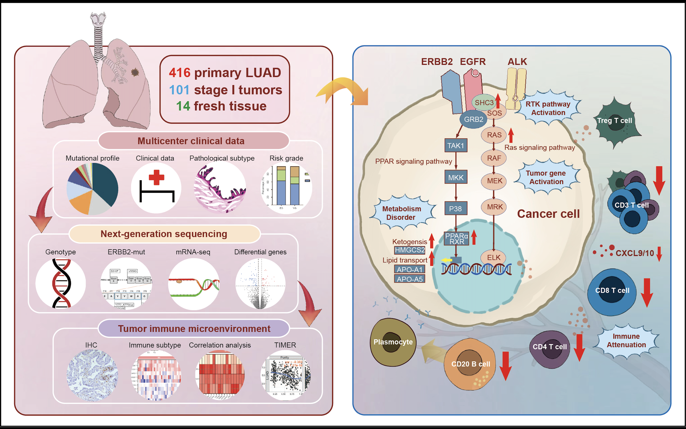
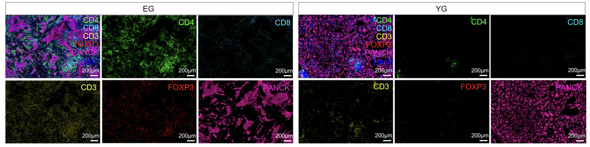
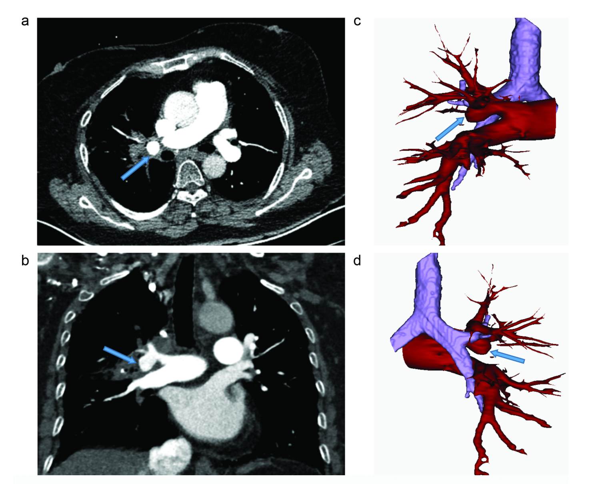
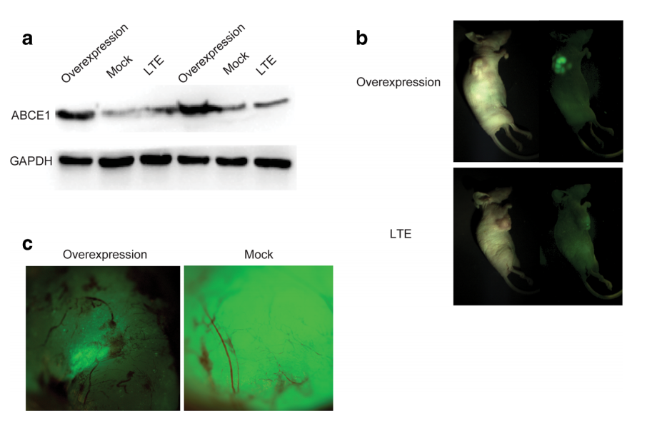
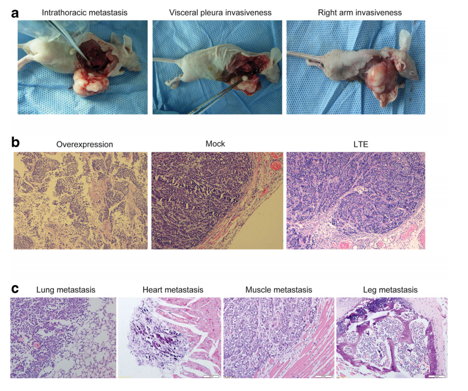

---
# Leave the homepage title empty to use the site title
title:
date: 2022-10-24
type: "landing"

sections:
  - block: markdown
    content:
      title: 
      subtitle: 
      text: 
        

          

            

              

                

                  
                

                <h3>临床工作及研究领域</h3>
                
田野医生任职于中国医科大学第四附属医院胸心外科，科室为沈阳市北部地区重要的肺癌微创治疗中心，数字化肺癌一体化诊疗中心，胸部创伤治疗中心，每年手术上千例，致力于肺癌的二、三级预防和治疗。

                
 田野医生拥有丰富的胸外科临床一线工作经验，以重要参与者完成相关成果转化“早期肺癌一体化诊治关键技术的建立与转化应用”，获得辽宁省科学技术进步二等奖。目前专注领域为：早发性肺癌的青年患者的筛查及诊治，难治性胸部肿瘤的综合治疗及前沿研究。

                <a href="https://www.cmu4h.cn/home" target="_blank">参考链接</a>
              

            

            

              

                

                  

                    
                  

                  

                    
                  

                  

                    
                  

                  

                    
                  

                  

                    
                  

                  

                    
                  

                  

                    
                  

                  

                    
                  

                  

                    
                  

                  

                    
                  

                

                <button class="carousel-control-prev" type="button" data-target="#carouselControls" data-slide="prev">
                  
                  Previous
                </button>
                <button class="carousel-control-next" type="button" data-target="#carouselControls" data-slide="next">
                  
                  Next
                </button>
              

            

          

        

---
